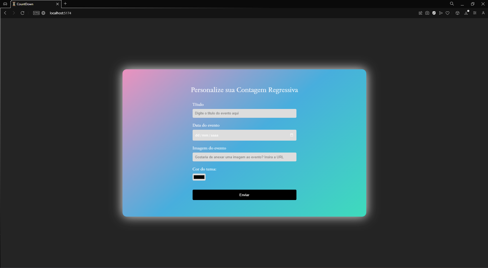
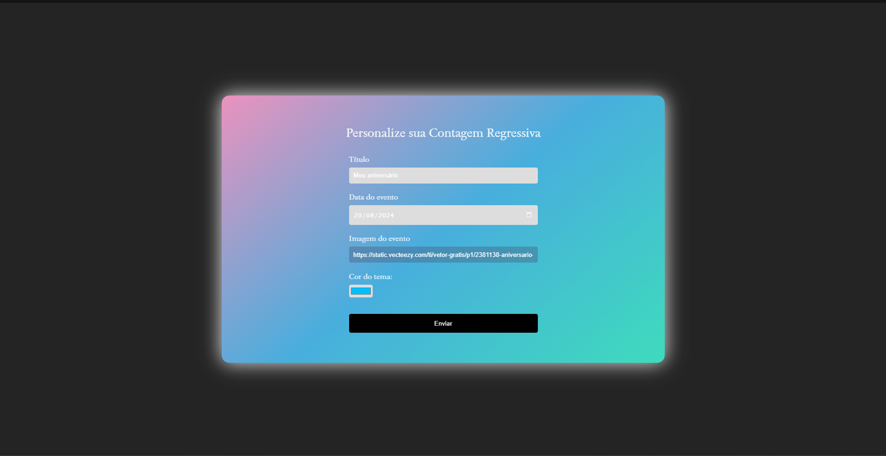
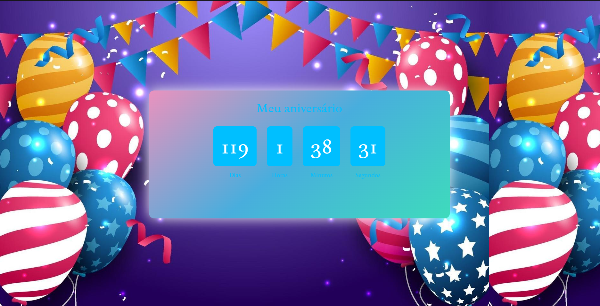
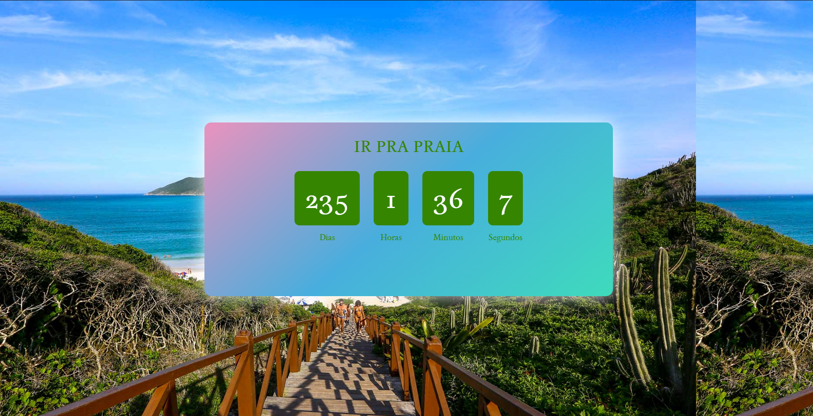

<h1 align="center"> Contagem Regressiva </h1>

.  An application to customize a countdown, you can define title, date, color and add an image to the event.

  <a href="#-tecnologias">Techs/Tecnologias</a>&nbsp;&nbsp;&nbsp;|&nbsp;&nbsp;&nbsp;
  <a href="#-projeto">Project/Projeto</a>&nbsp;&nbsp;&nbsp;|&nbsp;&nbsp;&nbsp;
  <a href="#-layout">Layout</a>&nbsp;&nbsp;&nbsp;|&nbsp;&nbsp;&nbsp;
  <a href="#memo-licença">License/Licença</a>

  

  

  

  

## 🚀 Techs / Tecnologias

Esse projeto foi desenvolvido com as seguintes tecnologias:

- HTML e CSS
- JavaScript
- React Js
- React Router
- Git e Github

## 💻 Project / Projeto

An application to customize a countdown, you can define title, date, color and add an image to the event.

Um aplicação para personalizar um contagem regressiva, você pode definir título, data, cor e adicionar uma imagem ao evento. 

## 🔖 Layout

Você pode visualizar o layout do projeto através do repositório. 

Feito com amor por Lara.
Made w/ love by Lara.